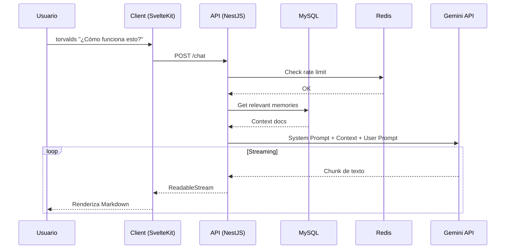

<div align="center">

# 🖥️ Portfolio Interactivo

**Un "Sistema Operativo" web con terminal funcional, asistente IA y arquitectura de microservicios.**

[](https://kit.svelte.dev/)
[](https://nestjs.com/)
[](https://mysql.com/)
[](https://redis.io/)
[](https://www.typescriptlang.org/)
[](https://www.docker.com/)

<a href="https://brianleft.com" target="_blank" rel="noopener noreferrer">
  
</a>

</div>

---

## 📋 Tabla de Contenidos

- [Descripción](#-descripción)
- [Características](#-características)
- [Arquitectura Multi-Tenant](#-arquitectura-multi-tenant)
- [Arquitectura](#-arquitectura)
- [Stack Tecnológico](#-stack-tecnológico)
- [Estructura del Proyecto](#-estructura-del-proyecto)
- [Quick Start](#-quick-start)
- [Desarrollo Local](#-desarrollo-local)
- [Comandos de Terminal](#-comandos-de-terminal)
- [API Endpoints](#-api-endpoints)
- [Variables de Entorno](#-variables-de-entorno)
- [Deployment Multi-Tenant](#-deployment-multi-tenant)
- [Documentación Técnica](#-documentación-técnica)
- [Licencia](#-licencia)

---

> 📚 **Documentación completa:** Para detalles técnicos, estado de implementación y roadmap, ver [`docs/TECHNICAL.md`](docs/TECHNICAL.md)

---

## 📖 Descripción

Este portfolio es una experiencia interactiva que simula un sistema operativo dentro del navegador. Los usuarios pueden explorar proyectos a través de un explorador de archivos visual o mediante una **terminal web completamente funcional**.

La pieza central es **TorvaldsAi**, un asistente de inteligencia artificial con la personalidad de Linus Torvalds, capaz de responder preguntas técnicas sobre los proyectos, la arquitectura y la experiencia profesional del autor.

> **Filosofía de diseño:** El código es la herramienta, la arquitectura es el objetivo. Este portfolio no solo muestra _qué_ sé hacer, sino _cómo_ pienso al construir software.

---

## ✨ Características

| Característica | Descripción |
|:---------------|:------------|
| **🖥️ Terminal Interactiva** | Emulador de consola con historial y comandos reales (`cd`, `ls`, `cat`, `tree`). Abre con `Ctrl + Ñ` |
| **🤖 TorvaldsAi** | Asistente IA con streaming de respuestas, renderizado Markdown y syntax highlighting (Google Gemini 2.5) |
| **📁 Sistema de Archivos Virtual** | Navegación de proyectos como directorios, almacenados en MySQL |
| **🧠 Sistema de Memoria Modular** | RAG inteligente que carga solo el contexto relevante para cada pregunta |
| **🔐 Autenticación JWT** | Panel admin protegido con access + refresh tokens |
| **⚡ Caché con Redis** | Sesiones, rate limiting y caché de respuestas |
| **🏢 Multi-Tenant White-Label** | Cada usuario tiene su subdominio personalizado |
| **🐳 Contenerizado** | Docker multi-stage optimizado con orquestación compose |

---

## 🏢 Arquitectura Multi-Tenant

Este portfolio funciona como plataforma **SaaS white-label**: cada usuario registrado obtiene su propio portfolio completamente personalizable en un subdominio único.

### Modelo de Datos

```
┌─────────────────────────────────────────────────────────────────────┐
│                           User (userId)                             │
│  ├── subdomain: "brian" → https://brian.brianleft.com              │
│  ├── email: "brian@example.com"                                     │
│  └── displayName: "Brian Benegas"                                  │
├─────────────────────────────────────────────────────────────────────┤
│  Datos aislados por usuario:                                        │
│  ├── Settings (configuración, branding, info personal)              │
│  ├── Memories (contexto IA personalizado)                           │
│  ├── AI Personalities (personalidades de asistente)                 │
│  ├── Folders/Files (filesystem virtual)                             │
│  └── Projects (proyectos y experiencia)                             │
└─────────────────────────────────────────────────────────────────────┘
```

### Flujo de Resolución de Subdominios

```
brian.brianleft.com
        │
        ▼
┌───────────────────┐
│     Nginx         │
│ (wildcard cert)   │
│ *.brianleft.com   │
└────────┬──────────┘
         │ X-Subdomain: brian
         ▼
┌───────────────────┐     ┌────────────────┐
│   SvelteKit       │────▶│   NestJS API   │
│  (hooks.server)   │     │ getUserBySubd  │
└───────────────────┘     └────────────────┘
         │                         │
         │ userId: 5               ▼
         │               ┌────────────────┐
         └──────────────▶│    MySQL       │
                         │ WHERE userId=5 │
                         └────────────────┘
```

### Características Multi-Tenant

| Característica | Descripción |
|:---------------|:------------|
| **Subdominios Únicos** | `usuario.brianleft.com` auto-asignado al registrarse |
| **Datos Aislados** | Cada entidad tiene `userId` para separación total |
| **Settings Personalizables** | Nombre, bio, redes sociales, colores, personalidad IA |
| **Rate Limiting por IP** | 15 peticiones/día gratis con Redis |
| **Free Tier** | Versión gratuita con límites, premium sin límites |

> 📚 **Documentación completa:** Ver [`docs/MULTI-TENANT.md`](docs/MULTI-TENANT.md) para configuración de VPS y Nginx

---

## 🏛️ Arquitectura

```
┌─────────────────┐     ┌─────────────────┐     ┌─────────────────┐
│     Client      │     │      API        │     │     MySQL 8     │
│   (SvelteKit)   │────▶│    (NestJS)     │────▶│   (TypeORM)     │
│   Port: 3000    │     │   Port: 4000    │     │   Port: 3306    │
└─────────────────┘     └────────┬────────┘     └─────────────────┘
                                 │
                                 ▼
                        ┌─────────────────┐
                        │      Redis      │
                        │   (Sessions)    │
                        │   Port: 6379    │
                        └─────────────────┘
```

### Flujo de Datos



---

## 🛠️ Stack Tecnológico

| Capa | Tecnología | Propósito |
|:-----|:-----------|:----------|
| **Frontend** | SvelteKit 5, Svelte 5 | Framework reactivo con SSR |
| **Backend** | NestJS 10, TypeORM | API REST con inyección de dependencias |
| **Database** | MySQL 8 | Persistencia de datos (filesystem, memorias, usuarios) |
| **Cache** | Redis 7 | Sesiones JWT, rate limiting, caché |
| **IA** | Google Gemini 2.5 Flash | Generación de respuestas (LLM) |
| **Auth** | JWT + bcrypt | Access tokens (15min) + Refresh tokens (7d) |
| **Container** | Docker + Compose | Orquestación de servicios |

---

## 📁 Estructura del Proyecto

```
brianleft-portfolio/
├── docker-compose.yml          # Orquestador de servicios
├── .env                        # Variables de entorno (no commitear)
├── .env.example                # Template de configuración
│
├── client/                     # 🖥️ Frontend (SvelteKit)
│   ├── Dockerfile
│   ├── src/
│   │   ├── lib/
│   │   │   ├── components/     # Terminal, FileViewer, ProjectLoader
│   │   │   ├── terminal/       # Lógica de comandos
│   │   │   ├── data/           # Datos iniciales para seeder
│   │   │   │   └── memory/     # Memorias IA (se migran a DB)
│   │   │   └── stores/         # Estado global Svelte
│   │   └── routes/
│   │       ├── +page.svelte    # Página principal
│   │       ├── admin/          # Panel de administración
│   │       └── api/            # Proxies al backend
│   └── static/
│
├── api/                        # ⚙️ Backend (NestJS)
│   ├── Dockerfile
│   ├── src/
│   │   ├── modules/
│   │   │   ├── auth/           # JWT login, refresh, guards
│   │   │   ├── users/          # CRUD usuarios
│   │   │   ├── filesystem/     # Carpetas y archivos virtuales
│   │   │   ├── memory/         # Memorias de IA + keywords
│   │   │   ├── chat/           # Integración Gemini + RAG
│   │   │   └── projects/       # Gestión de proyectos
│   │   ├── entities/           # TypeORM entities
│   │   ├── guards/             # JwtAuthGuard, RateLimitGuard
│   │   └── seeders/            # Migración de .md → MySQL
│   └── package.json
│
└── db/                         # 🗄️ Database (MySQL)
    ├── Dockerfile
    └── init.sql                # Schema inicial
```

---

## 🚀 Quick Start

### Requisitos

- Docker & Docker Compose v2+
- Node.js 20+ (solo para desarrollo local)

### Con Docker (Recomendado)

```bash
# 1. Clonar repositorio
git clone https://github.com/brianleft/portfolio.git
cd portfolio

# 2. Configurar variables de entorno
cp .env.example .env
# Editar .env con tus credenciales (especialmente GEMINI_API_KEY)

# 3. Levantar servicios
docker-compose up -d

# 4. Ver logs
docker-compose logs -f
```

La aplicación estará disponible en:

| Servicio | URL |
|----------|-----|
| Frontend | http://localhost:3000 |
| API | http://localhost:4000 |
| API Docs | http://localhost:4000/api/docs |

---

## 💻 Desarrollo Local

### API (NestJS)

```bash
cd api
npm install
npm run start:dev
```

### Client (SvelteKit)

```bash
cd client
npm install
npm run dev
```

### Base de Datos

```bash
# Solo MySQL y Redis
docker-compose up -d db redis

# Verificar conexión
docker-compose exec db mysql -u portfolio -p portfolio
```

---

## 🖥️ Comandos de Terminal

La terminal se abre con `Ctrl + Ñ` o haciendo clic en **"Hablar con TorvaldsAI (AI)"**.

### Navegación

| Comando | Descripción |
|:--------|:------------|
| `ls` / `ll` / `dir` | Lista archivos del directorio actual |
| `cd <dir>` | Cambia de directorio (`cd ..` para subir) |
| `pwd` | Muestra directorio actual |
| `tree` | Muestra árbol de directorios |

### Archivos

| Comando | Descripción |
|:--------|:------------|
| `cat <archivo>` | Muestra contenido de un archivo |
| `cv` / `resume` | Descarga el curriculum vitae |

### Inteligencia Artificial

| Comando | Descripción |
|:--------|:------------|
| `torvalds <pregunta>` | Pregunta directa a TorvaldsAI |
| `torvalds start` | Inicia modo chat interactivo |
| `torvalds [arquitecto]` | Cambia modo: arquitecto, debug, mentor |
| `apikey set <KEY>` | Configura tu API key de Gemini |
| `apikey status` | Ver estado de la API key |

### Cuenta & Administración

| Comando | Descripción |
|:--------|:------------|
| `register <user> <email>` | Crea tu cuenta y obtén subdominio |
| `admin` / `settings` | Abre panel de administración |

### Terminal

| Comando | Descripción |
|:--------|:------------|
| `cls` / `clear` | Limpia la terminal |
| `help` / `-h` | Muestra ayuda de comandos |
| `help <cmd>` | Ayuda detallada de un comando |
| `exit` | Cierra la terminal |

### Ejemplos de Uso

```bash
# Navegar y explorar proyectos
C:\> cd proyectos
C:\proyectos> ls -l
C:\proyectos> cat LEEME.md

# Hablar con la IA
C:\> torvalds ¿Cuál es la arquitectura del sistema?
C:\> torvalds [arquitecto] diseña una API REST para usuarios

# Crear tu propio portfolio
C:\> register miuser mi@email.com --name "Mi Nombre"
# Resultado: miuser.brianleft.com

# Usar tu propia API key para la IA
C:\> apikey set AIzaSy...tu-key
```

---

## 🔌 API Endpoints

### Autenticación

| Método | Endpoint | Descripción |
|:-------|:---------|:------------|
| POST | `/auth/register` | Crear cuenta nueva (devuelve subdominio) |
| POST | `/auth/login` | Login con username/password |
| POST | `/auth/refresh` | Renovar access token |
| POST | `/auth/logout` | Invalidar refresh token |
| GET | `/users/me` | Datos del usuario autenticado |

### Chat (IA)

| Método | Endpoint | Descripción |
|:-------|:---------|:------------|
| POST | `/chat` | Enviar mensaje a TorvaldsAI (streaming) |

> **Rate Limit:** 15 peticiones/día (free tier). Usa `apikey` para ilimitado.

### Filesystem

| Método | Endpoint | Descripción |
|:-------|:---------|:------------|
| GET | `/filesystem` | Árbol completo de carpetas |
| GET | `/filesystem/:id` | Detalle de carpeta/archivo |
| POST | `/filesystem/folder` | Crear carpeta |
| POST | `/filesystem/file` | Crear archivo |

### Memorias (Admin)

| Método | Endpoint | Descripción |
|:-------|:---------|:------------|
| GET | `/memories` | Listar memorias de IA |
| POST | `/memories` | Crear memoria + generar summary |
| PATCH | `/memories/:id` | Actualizar memoria |

---

## ⚙️ Variables de Entorno

| Variable | Descripción | Default |
|:---------|:------------|:--------|
| `DB_HOST` | Host de MySQL | `db` |
| `DB_PORT` | Puerto de MySQL | `3306` |
| `DB_NAME` | Nombre de la base de datos | `portfolio` |
| `DB_USER` | Usuario de MySQL | `portfolio` |
| `DB_PASSWORD` | Contraseña de MySQL | - |
| `DB_ROOT_PASSWORD` | Contraseña root de MySQL | - |
| `REDIS_HOST` | Host de Redis | `redis` |
| `REDIS_PORT` | Puerto de Redis | `6379` |
| `JWT_SECRET` | Secret para access tokens | - |
| `JWT_REFRESH_SECRET` | Secret para refresh tokens | - |
| `GEMINI_API_KEY` | API Key de Google Gemini | - |
| `ADMIN_USERNAME` | Usuario admin inicial | `admin` |
| `ADMIN_PASSWORD` | Contraseña admin inicial | - |

---

## 🐳 Deployment Multi-Tenant

### Producción con Docker Compose

```bash
# Build optimizado
docker-compose -f docker-compose.yml -f docker-compose.prod.yml up -d --build

# Ver estado
docker-compose ps

# Logs en tiempo real
docker-compose logs -f api
```

### Configuración de Subdominios (VPS)

Para habilitar subdominios personalizados, necesitas configurar Nginx con certificado wildcard:

#### 1. Certificado SSL Wildcard con Let's Encrypt

```bash
# Instalar certbot con plugin DNS (ejemplo Cloudflare)
sudo apt install python3-certbot-dns-cloudflare

# Crear archivo de credenciales
mkdir -p ~/.secrets/certbot
cat > ~/.secrets/certbot/cloudflare.ini << EOF
dns_cloudflare_api_token = TU_API_TOKEN_CLOUDFLARE
EOF
chmod 600 ~/.secrets/certbot/cloudflare.ini

# Obtener certificado wildcard
sudo certbot certonly \
  --dns-cloudflare \
  --dns-cloudflare-credentials ~/.secrets/certbot/cloudflare.ini \
  -d "brianleft.com" \
  -d "*.brianleft.com"
```

#### 2. Configuración Nginx

```nginx
# /etc/nginx/sites-available/portfolio
server {
    listen 443 ssl http2;
    server_name brianleft.com *.brianleft.com;

    ssl_certificate /etc/letsencrypt/live/brianleft.com/fullchain.pem;
    ssl_certificate_key /etc/letsencrypt/live/brianleft.com/privkey.pem;

    # Extraer subdomain del host
    set $subdomain "";
    if ($host ~* ^([^.]+)\.brianleft\.com$) {
        set $subdomain $1;
    }

    location / {
        proxy_pass http://localhost:3000;
        proxy_http_version 1.1;
        proxy_set_header Upgrade $http_upgrade;
        proxy_set_header Connection 'upgrade';
        proxy_set_header Host $host;
        proxy_set_header X-Real-IP $remote_addr;
        proxy_set_header X-Subdomain $subdomain;
        proxy_cache_bypass $http_upgrade;
    }

    location /api {
        proxy_pass http://localhost:4000;
        proxy_http_version 1.1;
        proxy_set_header Host $host;
        proxy_set_header X-Real-IP $remote_addr;
        proxy_set_header X-Subdomain $subdomain;
    }
}

# Redirect HTTP to HTTPS
server {
    listen 80;
    server_name brianleft.com *.brianleft.com;
    return 301 https://$host$request_uri;
}
```

#### 3. DNS en Cloudflare

```
Tipo     Nombre              Contenido           Proxy
A        brianleft.com       TU_IP_VPS           ✓
CNAME    *                   brianleft.com       ✓
```

### Registro de Nuevos Usuarios

```bash
# Crear nuevo usuario con su subdominio
curl -X POST http://localhost:4000/auth/register \
  -H "Content-Type: application/json" \
  -d '{
    "username": "nuevouser",
    "password": "password123",
    "email": "nuevo@email.com"
  }'

# El usuario obtiene automáticamente:
# - Subdominio: nuevouser.brianleft.com
# - Settings predeterminados (copiados del user 1)
# - Personalidad de IA por defecto
```

### Health Checks

```bash
# Verificar todos los servicios
curl http://localhost:4000/health
curl http://localhost:3000

# Verificar resolución de subdominios
curl -H "Host: brian.brianleft.com" http://localhost:3000
```

---

## 📚 Documentación Técnica

Para información detallada sobre:

| Documento | Contenido |
|-----------|-----------|
| [`docs/TECHNICAL.md`](docs/TECHNICAL.md) | Arquitectura, DB schema, API completa, estado de implementación, roadmap |

### Estado Actual del Proyecto

| Componente | Estado | Notas |
|------------|--------|-------|
| 🐳 Docker Infrastructure | ✅ Completo | 4 servicios orquestados |
| ⚙️ API NestJS | ✅ Completo | Auth, Memory, Chat, Uploads |
| 🗄️ Base de Datos | ✅ Completo | 7 entidades con userId, seeders funcionando |
| 🏢 Multi-Tenant | ✅ Completo | Subdominios, aislamiento por userId |
| ⏱️ Rate Limiting | ✅ Completo | Redis + fallback memoria, 15 req/día |
| 🎯 Parametrización | ✅ Completo | Placeholders + Settings por usuario |
| 🤖 Keywords IA | ✅ Completo | 15 keywords/memoria con Gemini |
| 📄 Upload CV | ✅ Completo | Endpoint + comando terminal |
| 🖥️ Admin Panel | ✅ Completo | Config de cuenta + settings |
| 🌐 Client Build | ✅ Completo | Dockerfile multi-stage |

---

## 🤝 Contribuir

1. Fork el proyecto
2. Crear branch (`git checkout -b feature/amazing-feature`)
3. Commit cambios (`git commit -m 'Add amazing feature'`)
4. Push al branch (`git push origin feature/amazing-feature`)
5. Abrir Pull Request

---

## 📄 Licencia

Este proyecto está licenciado bajo **GPL-3.0**. Ver [LICENSE](LICENSE) para más detalles.

---

<div align="center">

**Desarrollado con ☕ por [Brian Benegas](https://brianleft.com)**

[LinkedIn](https://linkedin.com/in/brianbenegas) • [GitHub](https://github.com/brianleft)

</div>
