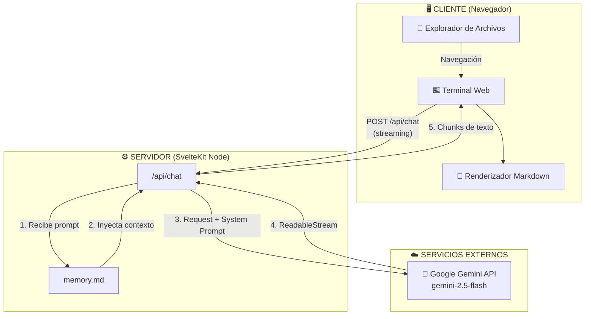
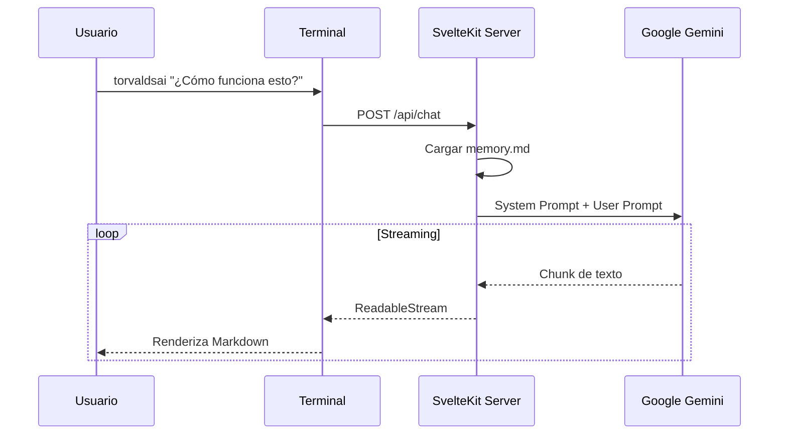

<div align="center">

# 🖥️ Portfolio Interactivo

**Un "Sistema Operativo" web con un asistente de IA integrado.**

[](https://kit.svelte.dev/)
[](https://www.typescriptlang.org/)
[](https://ai.google.dev/)
[](https://www.docker.com/)

<div align="center">

<a href="https://portfolio.brianleft.com" target="_blank" rel="noopener noreferrer">
  
</a>

</div>

</div>

---

## 📋 Tabla de Contenidos

- [Descripción](#-descripción)
- [Características Principales](#-características-principales)
- [Arquitectura del Sistema](#-arquitectura-del-sistema)
- [Stack Tecnológico](#-stack-tecnológico)
- [Instalación y Desarrollo](#-instalación-y-desarrollo)
- [Comandos de la Terminal](#-comandos-de-la-terminal)
- [Estructura del Proyecto](#-estructura-del-proyecto)
- [Configuración de la IA](#-configuración-de-la-ia)
- [Despliegue con Docker](#-despliegue-con-docker)
- [Documentación Interna](#-documentación-interna)
- [Licencia](#-licencia)

---

## 📖 Descripción

Este portfolio es una experiencia interactiva que simula un sistema operativo dentro del navegador. Los usuarios pueden explorar proyectos y contenido a través de un explorador de archivos visual o mediante una **terminal web completamente funcional**.

La pieza central es **TorvaldsAi**, un asistente de inteligencia artificial con la personalidad de Linus Torvalds, capaz de responder preguntas técnicas sobre la arquitectura del proyecto, la experiencia profesional del autor y los detalles de implementación de cada proyecto listado.

> **Filosofía de diseño:** El código es la herramienta, la arquitectura es el objetivo. Este portfolio no solo muestra _qué_ sé hacer, sino _cómo_ pienso al construir software.

---

## ✨ Características Principales

| Característica                  | Descripción                                                                                           |
| :------------------------------ | :---------------------------------------------------------------------------------------------------- |
| **Terminal Interactiva**        | Emulador de consola con historial, autocompletado y comandos personalizados. Abre con `Ctrl + Ñ`.     |
| **Sistema de Archivos Virtual** | Navegación por proyectos como si fueran directorios (`cd`, `ll`).                                     |
| **TorvaldsAi (IA Integrada)**   | Asistente con streaming de respuestas, renderizado Markdown y syntax highlighting. Usa Google Gemini. |
| **Docs as Code**                | La IA obtiene su conocimiento de un archivo Markdown (`memory.md`), fácil de versionar y mantener.    |
| **SSR + Hidratación**           | Renderizado del lado del servidor con SvelteKit para SEO y performance óptimos.                       |
| **Contenerizado**               | Dockerfile multi-stage optimizado (<100MB en imagen final).                                           |

---

## 🏛️ Arquitectura del Sistema



### Flujo de la IA



---

## 🛠️ Stack Tecnológico

| Capa                    | Tecnología               | Propósito                         |
| :---------------------- | :----------------------- | :-------------------------------- |
| **Frontend**            | SvelteKit 2, Svelte 5    | Framework reactivo con SSR        |
| **Estilos**             | Bootstrap 5, SASS        | Utilidades CSS y preprocesador    |
| **Lenguaje**            | TypeScript               | Tipado estático                   |
| **IA**                  | Google Gemini API        | Generación de respuestas (LLM)    |
| **Markdown**            | marked, marked-highlight | Parsing y renderizado de Markdown |
| **Syntax Highlighting** | highlight.js             | Coloreo de código en respuestas   |
| **Runtime**             | Node.js 20+              | Servidor SSR                      |
| **Contenedor**          | Docker (multi-stage)     | Despliegue optimizado             |

---

## 🚀 Instalación y Desarrollo

### Prerrequisitos

- **Node.js** >= 20.x
- **npm** >= 10.x (o pnpm/yarn)
- **API Key de Google Gemini** ([Obtener aquí](https://aistudio.google.com/app/apikey))

### Pasos

1.  **Clonar el repositorio:**

    ```bash
    git clone https://github.com/brianleft/portfolio.git
    cd portfolio
    ```

2.  **Instalar dependencias:**

    ```bash
    npm install
    ```

3.  **Configurar variables de entorno:**

    ```bash
    cp .env.example .env
    ```

    Edita `.env` y añade tu API Key:

    ```env
    GEMINI_API_KEY=tu_api_key_aqui
    ```

4.  **Iniciar servidor de desarrollo:**
    ```bash
    npm run dev
    ```
    Abre [http://localhost:5173](http://localhost:5173) en tu navegador.

---

## 💻 Comandos de la Terminal

La terminal se abre con `Ctrl + Ñ` o haciendo clic en el botón **"Hablar con Torvalds (AI)"**.

| Comando                  | Descripción                                            |
| :----------------------- | :----------------------------------------------------- |
| `help` / `-h`            | Muestra la ayuda con todos los comandos disponibles.   |
| `ls` / `ll` / `dir`      | Lista archivos y carpetas del directorio actual.       |
| `cd [dir]`               | Cambia de directorio. Usa `cd ..` para subir un nivel. |
| `cat <archivo>`          | Muestra el contenido de un archivo.                    |
| `tree`                   | Muestra árbol de directorios.                          |
| `pwd`                    | Muestra el directorio actual.                          |
| `cls` / `clear`          | Limpia la terminal.                                    |
| `torvalds`               | Activa el modo chat con TorvaldsAi.                    |
| `torvalds [pregunta]`    | Envía una pregunta directa a la IA.                    |

**Ejemplo de uso:**

```bash
C:\> ls
C:\> cd projects
C:\projects> cat portfolio.md
C:\projects> torvalds ¿Cuál es la arquitectura de este proyecto?
TorvaldsAi: Este portfolio está construido con SvelteKit usando SSR...
```

---

## 📁 Estructura del Proyecto

```
brianleft-portfolio/
├── src/
│   ├── lib/
│   │   ├── components/           # Componentes Svelte reutilizables
│   │   │   ├── Terminal.svelte       # Emulador de terminal principal
│   │   │   ├── FileViewer.svelte     # Visor de archivos Markdown
│   │   │   └── ProjectLoader.svelte  # Cargador de proyectos (Admin)
│   │   ├── data/
│   │   │   ├── file-system.ts        # Sistema de archivos virtual
│   │   │   └── memory/               # 🧠 Sistema de memoria modular
│   │   │       ├── index.md          # Perfil profesional
│   │   │       ├── memory.md         # Base de conocimiento para IA
│   │   │       ├── meta.md           # Autoconciencia del sistema
│   │   │       └── projects/         # Documentación por proyecto
│   │   │           ├── electoral.md
│   │   │           ├── migrador.md
│   │   │           ├── portfolio.md
│   │   │           └── ...
│   │   ├── terminal/             # Lógica de terminal
│   │   │   ├── index.ts              # Registry de comandos
│   │   │   ├── types.ts              # Tipos TypeScript
│   │   │   └── commands/             # Implementación de comandos
│   │   │       ├── cat.ts, cd.ts, ls.ts, tree.ts, pwd.ts
│   │   │       ├── torvalds.ts       # Comando de IA
│   │   │       └── help.ts
│   │   ├── docs/                 # Documentación interna (Docs as Code)
│   │   └── stores/               # Stores de Svelte (estado global)
│   ├── routes/
│   │   ├── +layout.svelte        # Layout principal
│   │   ├── +page.svelte          # Página de inicio
│   │   ├── admin/projects/       # Panel de administración
│   │   └── api/
│   │       ├── chat/+server.ts   # Endpoint de IA (streaming)
│   │       └── projects/+server.ts  # API de proyectos
│   └── app.html
├── mcp/                          # Servidor MCP para VS Code
│   └── gemini-server.js
├── dotfiles/                     # Configuración portable
├── static/
├── Dockerfile
└── package.json
```

---

## 🤖 Configuración de la IA

### Sistema de Memoria Modular (`src/lib/data/memory/`)

La IA utiliza un sistema de memoria **modular y dinámico** que optimiza el uso de tokens:

| Archivo | Propósito |
|---------|----------|
| `index.md` | Perfil profesional de Brian |
| `memory.md` | Base de conocimiento general |
| `meta.md` | Autoconciencia del sistema (arquitectura, comandos) |
| `projects/*.md` | Documentación detallada de cada proyecto |

**Carga Inteligente de Contexto:**

El servidor detecta keywords en el prompt del usuario y carga **solo los archivos relevantes**:
- Pregunta general → `index.md` + `memory.md`
- Pregunta sobre proyecto específico → archivo del proyecto completo
- Pregunta sobre arquitectura → `meta.md`
- Lista de proyectos → resúmenes optimizados (no archivos completos)

**Ventajas de este enfoque:**

- ✅ Versionable con Git (Docs as Code)
- ✅ Fácil de editar (es solo Markdown)
- ✅ Optimización de tokens (carga selectiva)
- ✅ Agregar proyectos sin tocar código
- ✅ Separación clara entre código y contenido

### Personalidad de la IA

El prompt del sistema en [`src/routes/api/chat/+server.ts`](src/routes/api/chat/+server.ts) define:

- Personalidad tipo Linus Torvalds (directo, técnico, pragmático)
- Respuestas en español argentino rioplatense
- Formato Markdown con syntax highlighting
- Diagramas ASCII para arquitectura
- Rate limiting (10 req/min por IP)

---

## 🐳 Despliegue con Docker

### Build y ejecución local:

```bash
# Construir imagen
docker build -t portfolio:latest .

# Ejecutar contenedor
docker run -d -p 3000:3000 \
  -e GEMINI_API_KEY=tu_api_key \
  --name portfolio \
  portfolio:latest
```

### Con Docker Compose:

```yaml
# docker-compose.yml
version: '3.8'
services:
    portfolio:
        build: .
        ports:
            - '3000:3000'
        environment:
            - GEMINI_API_KEY=${GEMINI_API_KEY}
        restart: unless-stopped
```

```bash
docker-compose up -d --build
```

---

## 📚 Documentación Interna

La documentación técnica profunda sigue el paradigma **Docs as Code** y se encuentra en:

| Documento        | Ubicación                                                        | Descripción                              |
| :--------------- | :--------------------------------------------------------------- | :--------------------------------------- |
| Perfil           | [`src/lib/data/memory/index.md`](src/lib/data/memory/index.md)   | Perfil profesional y proyectos           |
| Base Conocimiento| [`src/lib/data/memory/memory.md`](src/lib/data/memory/memory.md) | Contexto general para TorvaldsAi         |
| Autoconciencia   | [`src/lib/data/memory/meta.md`](src/lib/data/memory/meta.md)     | Arquitectura y funcionamiento interno    |
| Proyectos        | [`src/lib/data/memory/projects/`](src/lib/data/memory/projects/) | Documentación detallada por proyecto     |
| Arquitectura     | [`src/lib/docs/arquitectura.md`](src/lib/docs/arquitectura.md)   | Diagramas Mermaid del sistema            |
| Roadmap          | [`src/lib/docs/roadmap.MD`](src/lib/docs/roadmap.MD)             | Fases de evolución del proyecto          |
| Dotfiles         | [`dotfiles/README.md`](dotfiles/README.md)                       | Setup portable de terminal               |

> **Tip:** Podés preguntarle directamente a TorvaldsAi sobre cualquier aspecto del proyecto usando el comando `torvalds` en la terminal.

---

## 📄 Licencia

Este proyecto está licenciado bajo **GPL-3.0** (o posterior). Ver [LICENCE](LICENCE) para el texto completo y las instrucciones de uso.

---

<div align="center">

**Desarrollado con ☕ y entusiasmo por [Brian Benegas](https://portfolio.brianleft.com)**


</div>
