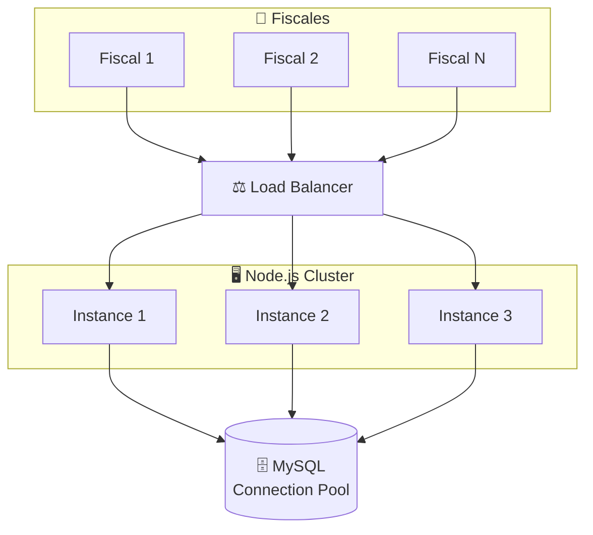
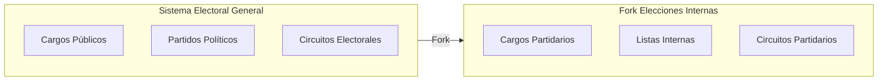

# PROYECTO: Sistema de Gestión Electoral

## Clasificación

- **Tipo:** Gobierno / Misión Crítica
- **Categoría:** Alta Concurrencia / Real-time
- **Estado:** Producción (múltiples elecciones)
- **Confidencialidad:** Parcial — Arquitectura pública, implementación privada

## El Desafío

Cómputo y fiscalización de votos en **tiempo real** donde:

- La caída del sistema **no es una opción** (tolerancia cero a fallos)
- fiscales cargando datos simultáneamente
- Dashboards públicos actualizándose en vivo para el intendente
- Auditoría completa de cada operación

## Stack Técnico

- **Frontend:** SvelteKit (SSR + hidratación)
- **Backend:** Node.js con NEST JS
- **Base de Datos:** MySQL con mysql2 (Connection Pooling)
- **Real-time:** Socket.io para broadcasting

## Arquitectura

### Manejo de Concurrencia

### Connection Pooling

- Pool de conexiones preestablecidas para evitar overhead de handshake
- Límites configurables por carga esperada
- Retry automático con backoff exponencial

### Broadcasting con WebSockets

- Rooms por nivel de acceso (público, fiscal, admin)
- Compresión de payloads para ancho de banda limitado
- Heartbeat para detectar conexiones zombies

## Seguridad

- **Auth Guards** por rol (fiscal, admin, auditor)
- Tokens JWT con expiración corta
- Rate limiting por IP y por usuario
- Logging exhaustivo para auditoría

## Métricas de Éxito

- **99.99% uptime** durante jornadas electorales
- **< 50ms** latencia promedio en carga de actas
- **0 inconsistencias** en conteo final vs actas físicas

## Fork: Sistema de Elecciones Internas

El sistema tuvo un **fork significativo** para adaptarse a elecciones internas de partidos políticos:

### Diferencias con el Sistema Principal
- **Cargos diferentes:** En lugar de cargos municipales/provinciales, se computan cargos internos del partido (Presidente PJ, secretarios, delegados, etc.)
- **Estructura de partidos:** Las agrupaciones compiten dentro del mismo partido en lugar de entre partidos
- **Circuitos adaptados:** La organización territorial se adapta a la estructura partidaria
- **Fiscalización interna:** Fiscales del propio partido supervisan el proceso

### Arquitectura del Fork

### Reutilización de Código
- **~80% del código base** se mantiene intacto
- Módulos de autenticación, WebSockets y exportación sin cambios
- Solo se adaptan los módulos de dominio (cargos, agrupaciones, circuitos)

## Por qué es "Good Code"

- Diseñado para el peor escenario (picos de 10x carga normal)
- Prioriza consistencia sobre velocidad cuando es necesario
- Cada decisión arquitectónica tiene justificación documentada
- **Arquitectura modular** que permitió crear un fork completo con mínimo esfuerzo

