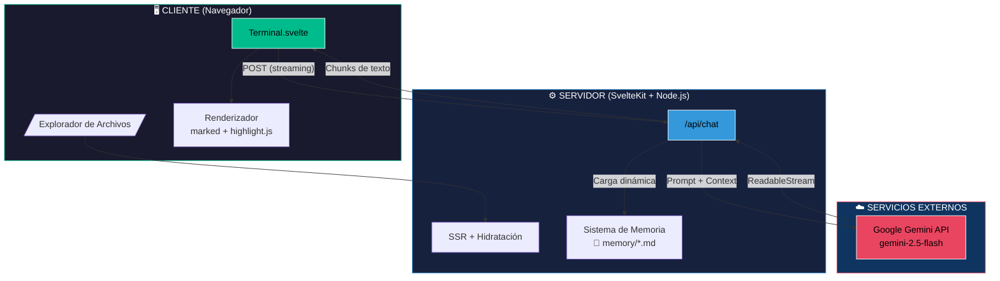
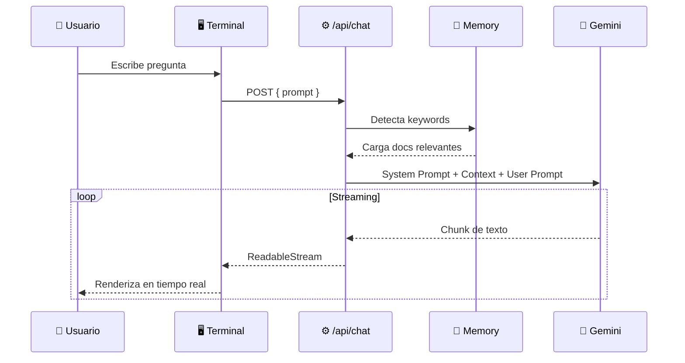

## 🏛️ Arquitectura del Sistema

```mermaid
flowchart TB
    subgraph Cliente ["🖥️ CLIENTE (Navegador)"]
        UI[/"Explorador de Archivos"/]
        Terminal["Terminal.svelte"]
        Markdown["Renderizador<br/>marked + highlight.js"]
    end

    subgraph Server ["⚙️ SERVIDOR (SvelteKit + Node.js)"]
        SSR["SSR + Hidratación"]
        API["/api/chat"]
        Memory["Sistema de Memoria<br/>📁 memory/*.md"]
    end

    subgraph External ["☁️ SERVICIOS EXTERNOS"]
        Gemini["Google Gemini API<br/>gemini-2.5-flash"]
    end

    UI --> SSR
    Terminal -->|"POST (streaming)"| API
    API -->|"Carga dinámica"| Memory
    API -->|"Prompt + Context"| Gemini
    Gemini -->|"ReadableStream"| API
    API -->|"Chunks de texto"| Terminal
    Terminal --> Markdown

    style Cliente fill:#1a1a2e,stroke:#00bc8c,color:#fff
    style Server fill:#16213e,stroke:#3498db,color:#fff
    style External fill:#0f3460,stroke:#e94560,color:#fff
    style Terminal fill:#00bc8c,stroke:#fff,color:#000
    style API fill:#3498db,stroke:#fff,color:#000
    style Gemini fill:#e94560,stroke:#fff,color:#000
```

### Flujo de Datos

```mermaid
sequenceDiagram
    participant U as 👤 Usuario
    participant T as 🖥️ Terminal
    participant A as ⚙️ /api/chat
    participant M as 📁 Memory
    participant G as 🤖 Gemini

    U->>T: Escribe pregunta
    T->>A: POST { prompt }
    A->>M: Detecta keywords
    M-->>A: Carga docs relevantes
    A->>G: System Prompt + Context + User Prompt

    loop Streaming
        G-->>A: Chunk de texto
        A-->>T: ReadableStream
        T-->>U: Renderiza en tiempo real
    end
```
