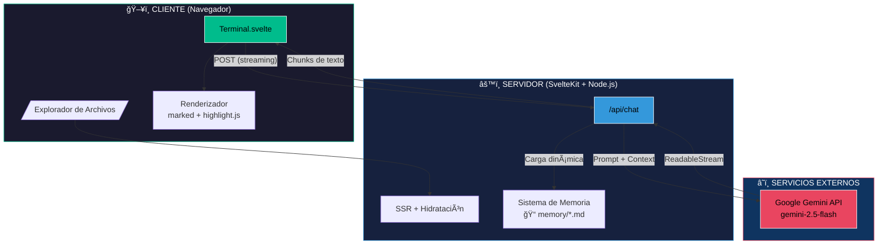
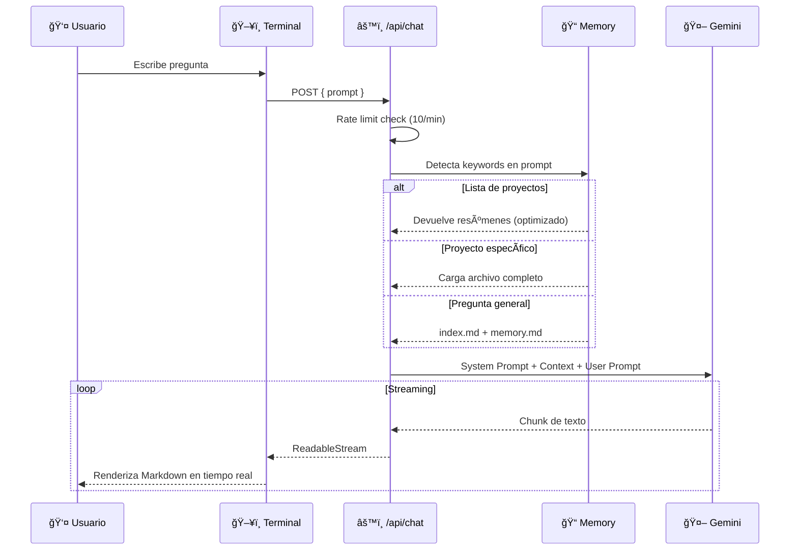
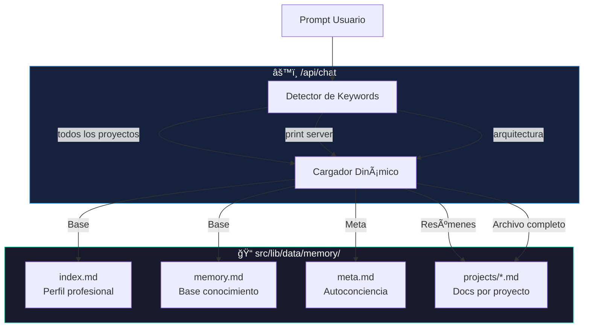

## ğŸ›ï¸ Arquitectura del Sistema

```mermaid
flowchart TB
    subgraph Cliente ["ğŸ–¥ï¸ CLIENTE (Navegador)"]
        UI[/"Explorador de Archivos"/]
        Terminal["Terminal.svelte"]
        Markdown["Renderizador<br/>marked + highlight.js"]
    end

    subgraph Server ["âš™ï¸ SERVIDOR (SvelteKit + Node.js)"]
        SSR["SSR + Hidratación"]
        API["/api/chat"]
        Memory["Sistema de Memoria<br/>📠memory/*.md"]
    end

    subgraph External ["â˜ï¸ SERVICIOS EXTERNOS"]
        Gemini["Google Gemini API<br/>gemini-2.5-flash"]
    end

    UI --> SSR
    Terminal -->|"POST (streaming)"| API
    API -->|"Carga dinámica"| Memory
    API -->|"Prompt + Context"| Gemini
    Gemini -->|"ReadableStream"| API
    API -->|"Chunks de texto"| Terminal
    Terminal --> Markdown

    style Cliente fill:#1a1a2e,stroke:#00bc8c,color:#fff
    style Server fill:#16213e,stroke:#3498db,color:#fff
    style External fill:#0f3460,stroke:#e94560,color:#fff
    style Terminal fill:#00bc8c,stroke:#fff,color:#000
    style API fill:#3498db,stroke:#fff,color:#000
    style Gemini fill:#e94560,stroke:#fff,color:#000
```

### Flujo de Datos

```mermaid
sequenceDiagram
    participant U as 👤 Usuario
    participant T as ğŸ–¥ï¸ Terminal
    participant A as âš™ï¸ /api/chat
    participant M as 📠Memory
    participant G as 🤖 Gemini

    U->>T: Escribe pregunta
    T->>A: POST { prompt }
    A->>A: Rate limit check (10/min)
    A->>M: Detecta keywords en prompt
    
    alt Lista de proyectos
        M-->>A: Devuelve resúmenes (optimizado)
    else Proyecto específico
        M-->>A: Carga archivo completo
    else Pregunta general
        M-->>A: index.md + memory.md
    end
    
    A->>G: System Prompt + Context + User Prompt

    loop Streaming
        G-->>A: Chunk de texto
        A-->>T: ReadableStream
        T-->>U: Renderiza Markdown en tiempo real
    end
```

### Sistema de Memoria Modular

```mermaid
flowchart TB
    subgraph Memory ["📠src/lib/data/memory/"]
        index["index.md<br/>Perfil profesional"]
        memory["memory.md<br/>Base conocimiento"]
        meta["meta.md<br/>Autoconciencia"]
        projects["projects/*.md<br/>Docs por proyecto"]
    end
    
    subgraph API ["âš™ï¸ /api/chat"]
        keywords["Detector de Keywords"]
        loader["Cargador Dinámico"]
    end
    
    prompt["Prompt Usuario"] --> keywords
    keywords -->|"todos los proyectos"| loader
    keywords -->|"print server"| loader
    keywords -->|"arquitectura"| loader
    
    loader -->|"Resúmenes"| projects
    loader -->|"Archivo completo"| projects
    loader -->|"Meta"| meta
    loader -->|"Base"| index
    loader -->|"Base"| memory
    
    style Memory fill:#1a1a2e,stroke:#00bc8c,color:#fff
    style API fill:#16213e,stroke:#3498db,color:#fff
```
